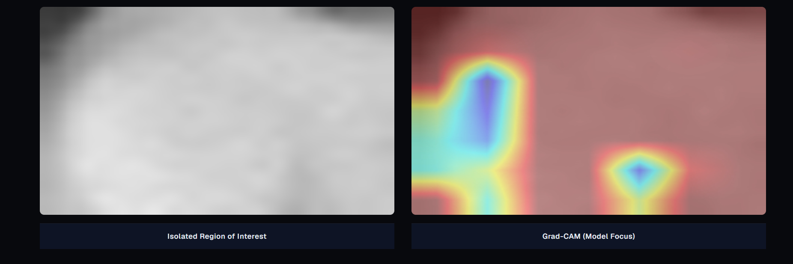
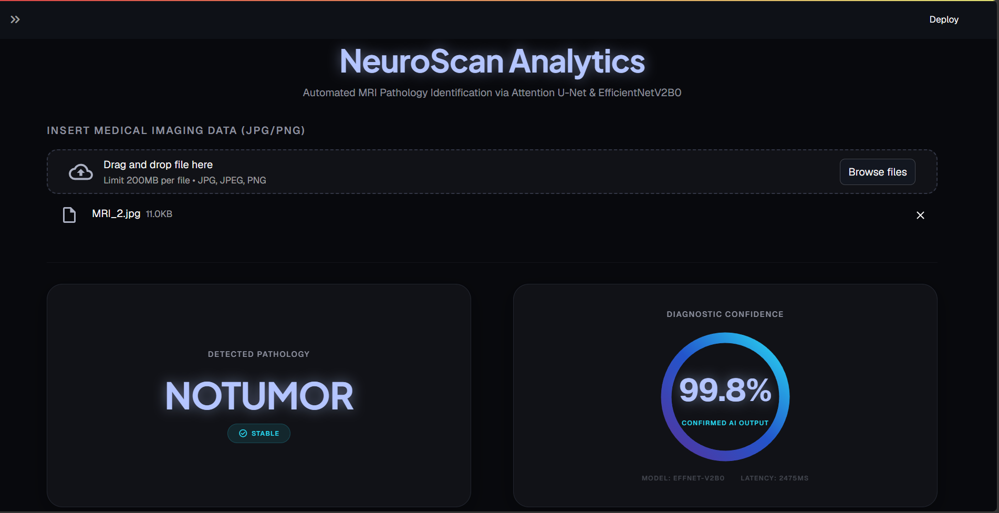
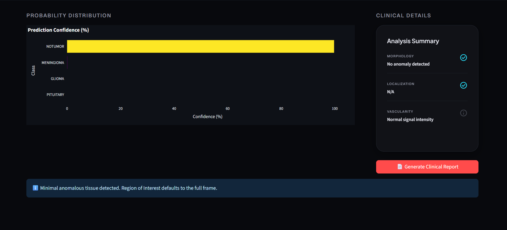

<div align="center">

# 🧠 NeuroScan-MRI

### Brain MRI Tumor Segmentation · Classification · Explainability


**[🚀 Live Demo](https://neuroscan-analytics.streamlit.app/)** &nbsp;•&nbsp; **[📂 Repository](https://github.com/omkarDhamgunde766/NeuroScan_MRI)** &nbsp;•&nbsp; **[👤 Author](https://github.com/omkarDhamgunde766)**

</div>

---

NeuroScan-MRI is an <ins>end-to-end deep learning research prototype</ins> for brain MRI <ins>tumor segmentation</ins>, <ins>multi-class tumor classification</ins>, and <ins>model explainability</ins>.

The system combines an **Attention U-Net** segmentation model with an **EfficientNetV2B0** classification model, and uses **Grad-CAM** to provide visual explanations of classification predictions.

The application provides an interactive **Streamlit dashboard** and a **FastAPI inference layer** for processing MRI scans.

> [!WARNING]
> NeuroScan-MRI is a <ins>research / academic prototype</ins> and is **not a clinically validated diagnostic system**.

---

## 📑 Table of Contents

| # | Section | # | Section |
|---|---------|---|---------|
| 1 | [Project Overview](#-project-overview) | 8 | [Getting Started](#-getting-started) |
| 2 | [Architecture](#%EF%B8%8F-architecture) | 9 | [Model Training](#-model-training) |
| 3 | [Dashboard Preview](#%EF%B8%8F-dashboard-preview) | 10 | [Running the Dashboard & API](#-running-the-dashboard) |
| 4 | [Live Demo](#-live-demo) | 11 | [Docker](#-docker) |
| 5 | [Core Features](#-core-features) | 12 | [Testing](#-testing) |
| 6 | [Model Performance](#-model-performance) | 13 | [Repository Structure](#-repository-structure) |
| 7 | [Tech Stack](#%EF%B8%8F-technology-stack) | 14 | [Future Improvements & Disclaimer](#-future-improvements) |

---

## 🧠 Project Overview

The system processes a brain MRI image through <ins>two complementary deep learning branches</ins>:

| Branch | Model | Output | Purpose |
|--------|-------|--------|---------|
| 🔬 **Segmentation** | Attention U-Net | Binary tumor mask | Visualizes the detected tumor region |
| 🧠 **Classification** | EfficientNetV2B0 (transfer learning) | 4-class prediction | Glioma · Meningioma · Pituitary · No Tumor |
| 🔎 **Explainability** | Grad-CAM | Heatmap | Shows regions that influenced the classifier |
| 🖥️ **Web Application** | Streamlit + FastAPI | Dashboard & REST endpoint | Interactive and programmatic access |

---

## 🏗️ Architecture

```text
                         ┌──────────────────────┐
                         │      MRI IMAGE       │
                         └──────────┬───────────┘
                                    │
                           Image Validation
                                    │
                    ┌───────────────┴───────────────┐
                    │                               │
                    ▼                               ▼
          ┌───────────────────┐           ┌────────────────────┐
          │   SEGMENTATION    │           │   CLASSIFICATION   │
          │      BRANCH       │           │       BRANCH       │
          └─────────┬─────────┘           └──────────┬─────────┘
                    │                                │
                    ▼                                ▼
          Grayscale Preprocessing            RGB Preprocessing
                    │                                │
                    ▼                                ▼
          ┌───────────────────┐           ┌────────────────────┐
          │   Attention U-Net │           │  EfficientNetV2B0  │
          └─────────┬─────────┘           └──────────┬─────────┘
                    │                                │
                    ▼                                ▼
             Binary Tumor Mask                4-Class Prediction
                    │                                │
                    │                       ┌────────┴─────────┐
                    │                       │                  │
                    │                       ▼                  ▼
                    │                 Predicted Class       Grad-CAM
                    │                       │             Explanation
                    │                       │                  │
                    └───────────────┬───────┴──────────────────┘
                                    │
                                    ▼
                         ┌──────────────────────┐
                         │ Streamlit Dashboard  │
                         │      + FastAPI       │
                         └──────────────────────┘
```

> [!IMPORTANT]
> **Architecture detail:** The segmentation and classification models operate as <ins>separate, independent branches</ins>.
> The segmentation mask is used **only for tumor-region visualization** and is <ins>not</ins> passed as input to the EfficientNetV2B0 classifier.
> The classifier receives the **original MRI image** through its own RGB preprocessing pipeline.

---

## 🖥️ Dashboard Preview

<table>
  <tr>
    <td align="center" width="50%">
      <br/>
      <b>MRI Scan & Segmentation</b><br/>
      <sub>Raw MRI scan with predicted segmentation mask overlay</sub>
    </td>
    <td align="center" width="50%">
      <br/>
      <b>Region Visualization & Grad-CAM</b><br/>
      <sub>Tumor-region visualization and model-focus heatmap</sub>
    </td>
  </tr>
  <tr>
    <td align="center" colspan="2">
      <br/>
      <b>Classification Probability & Details</b><br/>
      <sub>Confidence distribution and analysis information</sub>
    </td>
  </tr>
</table>

---

## 🚀 Live Demo

> [!TIP]
> **NeuroScan Analytics Dashboard:** [https://neuroscan-analytics.streamlit.app/](https://neuroscan-analytics.streamlit.app/)

The live dashboard lets you upload an MRI scan and view:

| 🔬 Segmentation | 🧠 Classification | 📊 Probabilities | 🔥 Grad-CAM | ℹ️ Analysis Info |
|:---:|:---:|:---:|:---:|:---:|
| Tumor mask | Predicted class | Confidence scores | Model focus map | Run details |

---

## 🌟 Core Features

### 🔬 1. Brain Tumor Segmentation

The segmentation branch uses an <ins>Attention U-Net</ins> architecture built on convolutional layers and attention mechanisms. It predicts a **binary tumor-region mask** from the MRI image.

| Property | Value |
|----------|-------|
| Training loss | **BCE + Dice Loss** |
| Why Dice? | Addresses the imbalance between tumor and background pixels |

### 🧠 2. Multi-Class Tumor Classification

The classification branch uses <ins>EfficientNetV2B0</ins> with transfer learning and predicts one of four classes:

| 🟣 Glioma | 🔵 Meningioma | 🟠 Pituitary | 🟢 No Tumor |
|:---:|:---:|:---:|:---:|

The classifier uses the **original MRI image** after RGB preprocessing.

### 🔎 3. Grad-CAM Explainability

Grad-CAM generates a heatmap showing the regions of the MRI that contributed to the classification prediction.

> [!NOTE]
> The heatmap is an <ins>interpretability aid</ins>, not a clinically validated tumor boundary.

### 🖥️ 4. Interactive Dashboard

The Streamlit application provides:

- ✅ MRI image upload
- ✅ Segmentation visualization
- ✅ Classification prediction
- ✅ Confidence / probability display
- ✅ Grad-CAM visualization
- ✅ Analysis history / interface components

### ⚡ 5. FastAPI Inference Layer

A FastAPI application provides an inference endpoint for integrating the trained models with other applications.

```http
POST /api/v1/predict
```

---

## 📊 Model Performance

Results are reported on the <ins>held-out evaluation sets</ins> used for the current project results.

### Classification — EfficientNetV2B0

| Metric | Value |
|--------|-------|
| **Overall Test Accuracy** | **94.06%** |
| Test set size | 1,600 held-out MRI images |
| Number of classes | 4 |

| Class | Precision | Recall | F1-Score |
|-------|:---------:|:------:|:--------:|
| Glioma | 0.98 | 0.80 | 0.88 |
| Meningioma | 0.90 | 0.97 | 0.93 |
| Pituitary | 0.98 | 1.00 | 0.99 |
| No Tumor | 0.91 | 1.00 | 0.95 |

> [!NOTE]
> Performance varies across tumor categories. <ins>Glioma has lower recall</ins> than the other reported classes.

### Segmentation — Attention U-Net

| Metric | Result |
|--------|:------:|
| Pixel Accuracy | 99.29% |
| **Dice Coefficient** | **76.41%** |
| Mean IoU | 49.14% |

> [!IMPORTANT]
> <ins>Pixel accuracy</ins> should be interpreted carefully because MRI segmentation contains a large number of background pixels.
> For tumor-region overlap, the <ins>Dice coefficient</ins> is a more informative measure of segmentation quality.

---

## 🛠️ System Components

| Subsystem | Technology | Purpose |
|-----------|-----------|---------|
| Segmentation | Attention U-Net | Predicts binary tumor-region mask |
| Classification | EfficientNetV2B0 | Four-class MRI classification |
| Explainability | Grad-CAM | Visualizes classifier focus |
| Dashboard | Streamlit | Interactive MRI analysis interface |
| API | FastAPI | Prediction / inference endpoint |
| Visualization | Plotly | Charts and confidence visualization |
| Computer Vision | OpenCV | Image preprocessing |
| Deep Learning | TensorFlow / Keras | Model development and inference |
| Testing | pytest | Automated testing |
| Containerization | Docker | Application containerization |

---

## 🧰 Technology Stack

### 🤖 Deep Learning & Computer Vision

| Category | Technology |
|----------|-----------|
| Deep Learning Framework | TensorFlow |
| Neural Network API | Keras |
| Segmentation Model | Attention U-Net |
| Classification Model | EfficientNetV2B0 |
| Explainability | Grad-CAM |
| Computer Vision | OpenCV |
| Image Processing | Pillow |
| Numerical Computing | NumPy |
| Data Processing | pandas |
| ML Utilities | scikit-learn |

### 🖥️ Application Layer

| Category | Technology |
|----------|-----------|
| Web Dashboard | Streamlit |
| Backend API | FastAPI |
| ASGI Server | Uvicorn |
| Visualization | Plotly |
| Configuration | YAML / PyYAML |
| Environment Variables | python-dotenv |

### ⚙️ Infrastructure & Testing

| Category | Technology |
|----------|-----------|
| Containerization | Docker |
| Service Orchestration | Docker Compose |
| Testing | pytest |
| Model Format | Keras `.keras` |

---

## 🚀 Getting Started

### 1️⃣ Clone the Repository

```bash
git clone https://github.com/omkarDhamgunde766/NeuroScan_MRI.git
cd NeuroScan_MRI
```

### 2️⃣ Create a Virtual Environment

**Windows**
```bash
python -m venv venv
venv\Scripts\activate
```

**Linux / macOS**
```bash
python3 -m venv venv
source venv/bin/activate
```

### 3️⃣ Install Dependencies

```bash
pip install -r requirements.txt
```

### 4️⃣ Configure the Project

The project uses <ins>`config.yaml`</ins>. Dataset paths are configured through this file.

**Expected dataset structure:**

```text
data/
└── raw/
    ├── classification/
    │   ├── training/
    │   │   ├── Glioma/
    │   │   ├── Meningioma/
    │   │   ├── NoTumor/
    │   │   └── Pituitary/
    │   │
    │   └── testing/
    │       ├── Glioma/
    │       ├── Meningioma/
    │       ├── NoTumor/
    │       └── Pituitary/
    │
    └── segmentation/
        ├── Glioma/
        ├── Meningioma/
        └── Pituitary/
```

---

## 🧪 Model Training

| Model | Command | Saved To |
|-------|---------|----------|
| 🔬 Segmentation | `python -m scripts.train_segmenter --config config.yaml` | `checkpoints/neuroscan_seg.keras` |
| 🧠 Classification | `python -m scripts.train_classifier --config config.yaml` | `checkpoints/neuroscan_cls.keras` |

---

## 🖥️ Running the Dashboard

Activate the virtual environment first, then run:

```bash
python -m streamlit run app/dashboard.py
```

The application opens in the browser. Upload an MRI image and the pipeline runs as follows:

```text
MRI Image
   ↓
Preprocessing
   ↓
Segmentation + Classification
   ↓
Tumor Mask + Predicted Class
   ↓
Grad-CAM Explanation
   ↓
Dashboard Visualization
```

### ⚡ Running the API

The FastAPI application is located at `app/api.py` and exposes:

```http
POST /api/v1/predict
```

> [!NOTE]
> The exact server command depends on the application configuration.

---

## 🐳 Docker

The project contains a `Dockerfile` and `docker-compose.yml`. To build and start the containerized services:

```bash
docker-compose up --build
```

| Service | Local URL |
|---------|-----------|
| 🖥️ Dashboard | http://localhost:8501 |
| ⚡ API | http://localhost:8000 |

---

## 🧪 Testing

Activate the virtual environment and run:

```bash
pytest tests/ -v
```

**Test coverage includes:**

| Segmentation model | Classification model | Data pipeline | Inference pipeline |
|:---:|:---:|:---:|:---:|
| **Explainability** | **Visualization** | **FastAPI** | |

---

## 📁 Repository Structure

```text
NeuroScan_MRI/
│
├── app/
│   ├── dashboard.py
│   └── api.py
│
├── checkpoints/
│   ├── neuroscan_cls.keras
│   └── neuroscan_seg.keras
│
├── data/
│   └── raw/
│       ├── classification/
│       └── segmentation/
│
├── docs/
│   ├── dashboard1.png
│   ├── dashboard2.png
│   ├── dashboard3.png
│   └── dashboard4.png
│
├── neuroscan/
│   ├── __init__.py
│   ├── config_loader.py
│   ├── data_pipeline.py
│   ├── seg_model.py
│   ├── cls_model.py
│   ├── trainer.py
│   ├── inference.py
│   ├── explainability.py
│   └── visualizer.py
│
├── notebooks/
│   └── neuroscan_kaggle_training.ipynb
│
├── scripts/
│   ├── convert_tif_to_png.py
│   ├── evaluate_models.py
│   ├── generate_synthetic_data.py
│   ├── kaggle_train_script.py
│   ├── train_classifier.py
│   └── train_segmenter.py
│
├── tests/
│   ├── conftest.py
│   ├── test_api.py
│   ├── test_cls_model.py
│   ├── test_data_pipeline.py
│   ├── test_explainability.py
│   ├── test_inference.py
│   ├── test_seg_model.py
│   └── test_visualizer.py
│
├── config.yaml
├── Dockerfile
├── docker-compose.yml
├── pyproject.toml
├── requirements.txt
├── run_neuroscan.bat
├── runtime.txt
└── README.md
```

---

## 🔬 Research Workflow

```text
             MRI Image
                 │
                 ▼
        Image Validation
                 │
        ┌────────┴────────┐
        │                 │
        ▼                 ▼
  Segmentation      Classification
   Attention U-Net   EfficientNetV2B0
        │                 │
        ▼                 ▼
   Tumor Mask       Tumor Class
        │                 │
        │             Grad-CAM
        │                 │
        └────────┬────────┘
                 ▼
        Streamlit Dashboard
```

---

## 🔮 Future Improvements

| 🧊 Data & Modalities | 🎯 Model Quality | 🚢 Deployment & Research |
|----------------------|------------------|--------------------------|
| 3D MRI volume processing (NIfTI) | Improved tumor-region segmentation | Scalable deployment infrastructure |
| Multi-modal MRI (T1, T1Gd, T2, FLAIR) | Model calibration & uncertainty estimation | Privacy-preserving / federated learning |
| Independent dataset validation | More robust external validation | |

---

## ⚠️ Research Disclaimer

> [!CAUTION]
> NeuroScan-MRI is developed as an <ins>academic / research project</ins> for brain MRI image analysis.
>
> Model predictions, segmentation masks, confidence values, and Grad-CAM visualizations <ins>**must not be interpreted as a medical diagnosis**</ins>.
>
> Clinical deployment would require <ins>medical validation</ins>, <ins>independent testing</ins>, <ins>regulatory approval</ins>, <ins>data governance</ins>, and evaluation by <ins>qualified medical professionals</ins>.

---

## 👤 Author

<table>
  <tr>
    <td><b>Omkar Dhamgunde</b></td>
    <td><a href="https://github.com/omkarDhamgunde766">GitHub Profile</a></td>
    <td><a href="https://github.com/omkarDhamgunde766/NeuroScan_MRI">NeuroScan-MRI Repository</a></td>
  </tr>
</table>

---

## ⭐ Acknowledgement

This project was developed as an <ins>academic / final-year project</ins> focused on applying deep learning techniques to brain MRI tumor <ins>segmentation</ins>, <ins>classification</ins>, and <ins>explainability</ins>.

<div align="center">

**If you found this project useful, consider giving it a ⭐ on GitHub!**

</div>